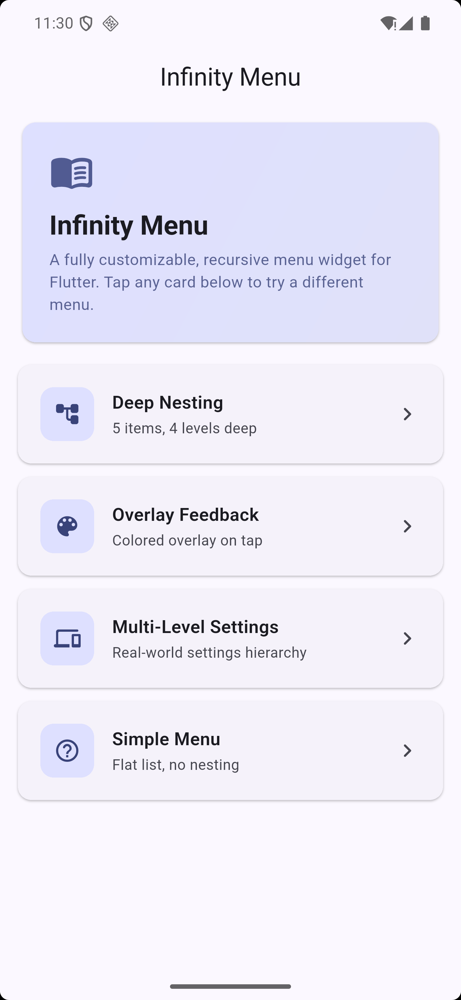
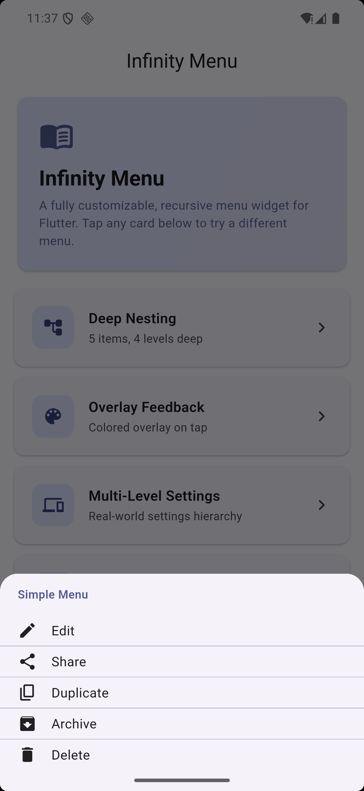
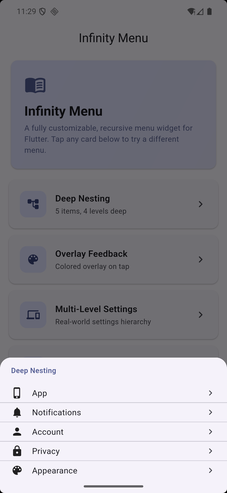
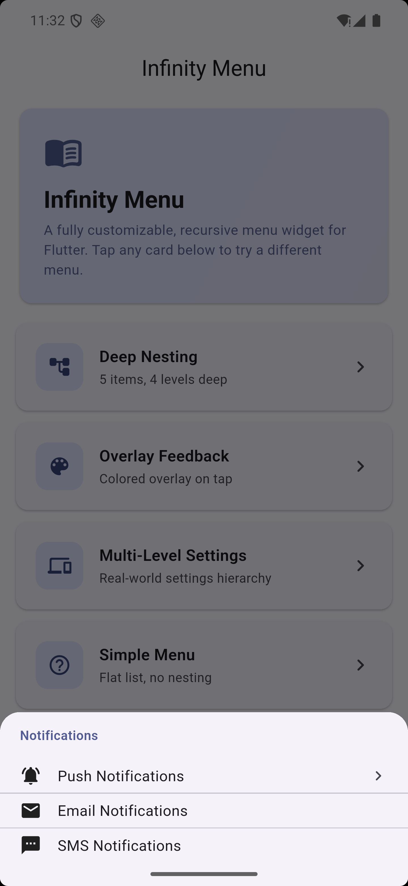
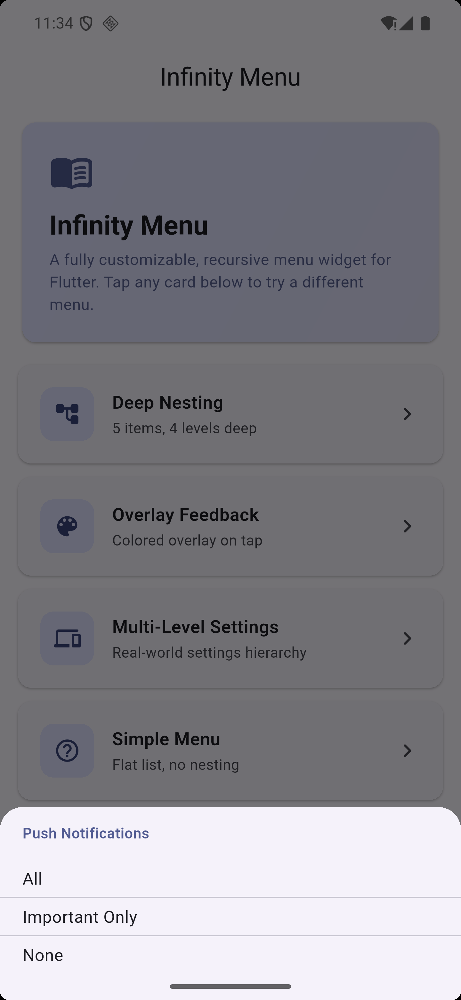
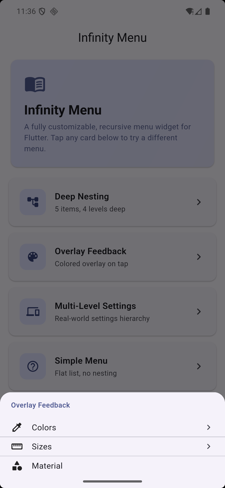
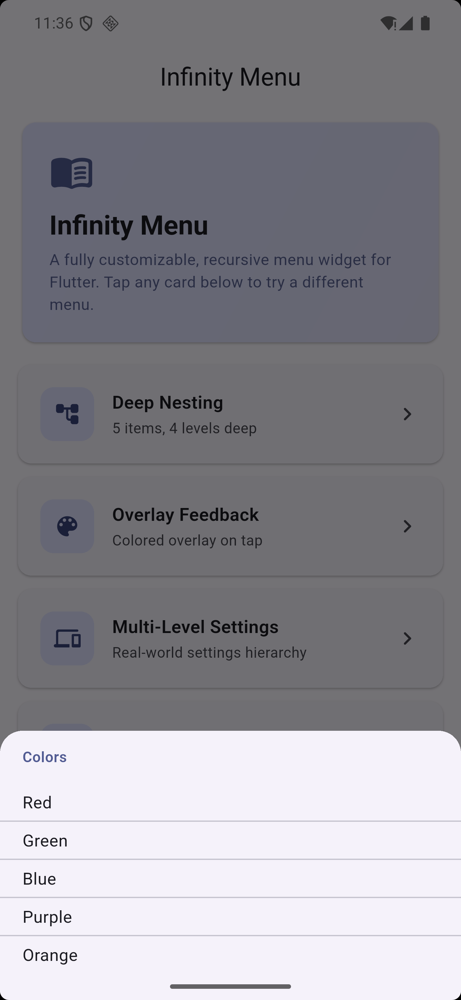

# ∞ infinity_menu

A fully customizable menu for Flutter apps — nested menus, tap feedback, and more.

## Installation

#### From pub.dev

Add this to your `pubspec.yaml`

```yaml
dependencies:
  infinity_menu: ^1.0.0
```

#### Or, From Git repo

```yaml
dependencies:
  infinity_menu:
    git:
      url: https://github.com/Ragibn5/dart-flutter-packages.git
      path: infinity_menu
      ref: infinity_menu-1.0.0
```

For more information, see the [package on pub.dev](https://pub.dev/packages/infinity_menu) or the [GitHub repository](https://github.com/Ragibn5/dart-flutter-packages/tree/main/infinity_menu).

---

## ✨ Features

- **♾️ Infinite nesting** — nest submenus to any depth.
- **🎨 UI-agnostic** — you control how every item looks via builder callbacks.
- **👆 Built-in tap feedback** — opacity fade or color overlay, with configurable duration.
- **📐 Customizable layout** — shrink wrap, padding, scroll physics.
- **📦 Zero runtime dependencies** — only the Flutter SDK.

## 📸 Screenshots

<p style="text-align: center">
  
  &nbsp;&nbsp;
  
</p>

<p style="text-align: center">
  
  
  
</p>

<p style="text-align: center">
  
  &nbsp;&nbsp;
  
</p>

## 🚀 Usage

### 1. Define your menu data

Build your menu tree with `MenuData` and `MenuItemData`. Nest as deep as you want — just set `subMenuData`.

```
import 'package:infinity_menu/infinity_menu.dart';

final menuData = MenuData<String>(
  menuItems: [
    MenuItemData<String>(
      data: 'theme',
      itemTitle: 'Theme',
      subMenuData: MenuData<String>(
        menuItems: [
          MenuItemData(data: 'light', itemTitle: 'Light', onItemAction: _onSelect),
          MenuItemData(data: 'dark', itemTitle: 'Dark', onItemAction: _onSelect),
        ],
      ),
    ),
    MenuItemData(data: 'settings', itemTitle: 'Settings', onItemAction: _onSelect),
  ],
);
```

### 2. Present the menu

Drop a `Menu` into any widget — bottom sheet, popup, dialog, wherever. You control how each item looks via `menuItemBuilder`.

```
showModalBottomSheet(
  context: context,
  builder: (_) => Menu<String>(
    menuData: menuData,
    menuItemBuilder: (index, size, item) => ListTile(
      title: Text(item.itemTitle),
      trailing: item.subMenuData != null ? Icon(Icons.chevron_right) : null,
    ),
    separatorBuilder: (_, __, ___) => Divider(height: 1),
    menuHeaderBuilder: (_, parent) => Padding(
      padding: EdgeInsets.all(8),
      child: Text(parent?.itemTitle ?? 'Menu', style: TextStyle(fontWeight: FontWeight.bold)),
    ),
    onSubmenuRequest: (ctx, submenu, parent) => _openMenu(ctx, submenu),
  ),
);
```

### 3. Recursively open submenus

When a user taps an item with a submenu, `onSubmenuRequest` fires. Just call your own function again — the recursion handles the rest.

```
void _openMenu(BuildContext context, MenuData<String> submenu) {
  showModalBottomSheet(
    context: context,
    builder: (_) => Menu<String>(
      menuData: submenu,
      menuItemBuilder: (index, size, item) => ListTile(title: Text(item.itemTitle)),
      onSubmenuRequest: (ctx, sub, parent) => _openMenu(ctx, sub),
    ),
  );
}
```

## 🧪 Example

See [`example.dart`](example.dart) for a complete runnable example, or [`demo/`](demo) for a standalone Flutter project.

---