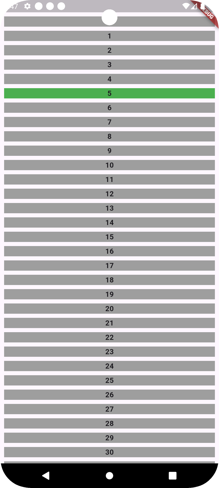
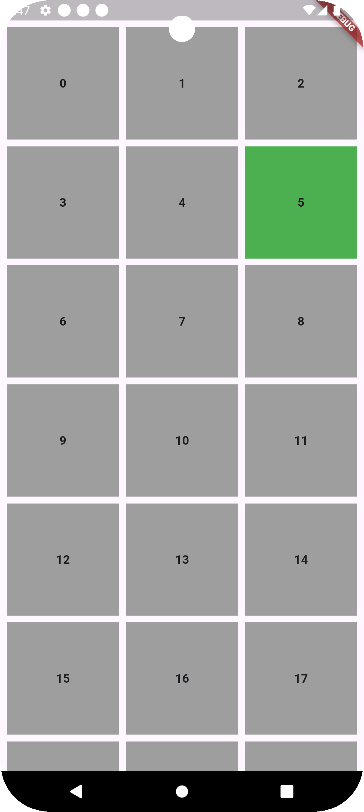
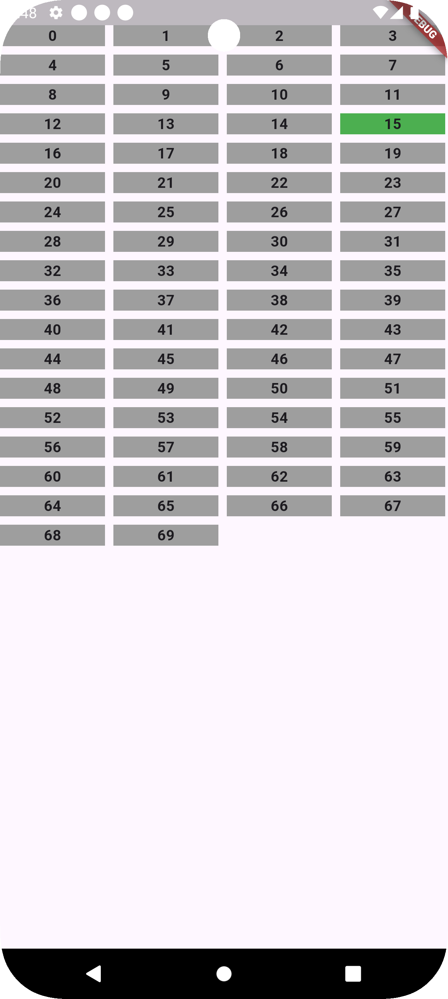

# radio_group

A fully customizable radio group.

## Installation

#### From pub.dev (Not yet available, use git based dependency management for now)

Add this to your `pubspec.yaml`

```yaml
dependencies:
  radio_group: ^0.0.1
```

#### Or, From Git repo (Internal members only)

```yaml
dependencies:
  radio_group:
    git:
      url: https://github.com/Ragibn5/dart-flutter-packages.git
      path: radio_group
      ref: main
```

## Get Started

Use the [`RadioGroup`](lib/src/widgets/radio_group.dart) to construct r radio group widget.
It expects the following components:

- `uiModels`: List of ui models (Subtype of [
  `RadioItemUiModel`](lib/src/models/radio_item_ui_model.dart)).
  If you want an item to be non-selectable, set `shouldBeSelected` = false.
- `layoutConfig`: A layout config (Subtype of [
  `RadioGroupLayoutConfig`](lib/src/configs/radio_group_layout_config.dart)).
  Can be one of the following:
    - `ListRadioGroupLayoutConfig`: For a `ListView` style radio group.
    - `GridRadioGroupLayoutConfig`: For a `GridView` style radio group.
    - `WrapRadioGroupLayoutConfig`: For a `Wrap` style radio group.
      See the constructor parameters of each config type to know all the customization you can make.
- `cellBuilder`: A callback to provide a scope where you can return the widget for the given index.
  Use the provided ui model and the selection status (named) to create the widget you want. Please
  note, you have to differentiate between selected and non-selected appearance with the widget you
  return to this callback. In fact, this package does not provide any default ui or styles at all,
  it shows what you provide.
- `onSelectionChanged`: A callback to notify which option was selected. The callback provides the
  corresponding ui model, i.e. the uiModel of the selected cell.
- `initialSelectionIndex`: The index of the initial selection.
- `leadingWidgets` & `trailingWidgets`: If you want to add specific widgets before and after the
  actual widgets (that are for selection).

<br>

For example, consider the following widget:

```dart
// The Ui Model
class TestItemUiModel extends RadioItemUiModel {
  final int i;

  TestItemUiModel({super.shouldBeSelected = true, required this.i});
}

// Host Widget
class TestWidget extends StatelessWidget {
  final List<TestItemUiModel> uiModels;
  final RadioGroupLayoutConfig layoutConfig;

  const TestWidget({
    super.key,
    required this.uiModels,
    required this.layoutConfig,
  });

  @override
  Widget build(BuildContext context) {
    return RadioGroup(
      uiModels: uiModels,
      layoutConfig: layoutConfig,
      cellBuilder: (model, {required selected}) =>
          _buildCell(model.i, selected),
      onSelectionChanged: (selectedModel) => debugPrint("$selectedModel"),
    );
  }

  // The cell builder method.
  // You should use a stateless widget instead, this is just for demonstration.
  Widget _buildCell(int i, bool selected) {
    return Container(
      color: selected ? Colors.green : Colors.grey,
      child: Center(
        child: Text(
          "$i",
          style: TextStyle(fontWeight: FontWeight.w700),
        ),
      ),
    );
  }
}
```

<br>

For `ListRadioGroupLayoutConfig`:

```dart

final listLayoutConfig = ListRadioGroupLayoutConfig.scrollable(
  spacing: 8,
  padding: EdgeInsets.all(8),
);
```

Preview:


<br>

For `GridRadioGroupLayoutConfig`:

```dart

final gridLayoutConfig = GridRadioGroupLayoutConfig.scrollable(
  horizontalSpacing: 8,
  verticalSpacing: 8,
  padding: EdgeInsets.all(8),
);
```

Preview:


<br>

For `WrapRadioGroupLayoutConfig`:

```dart

final wrapLayoutConfig = WrapRadioGroupLayoutConfig(
  spacing: 8,
  runSpacing: 8,
);
```

Preview:


## License

Click [here](../LICENSE) to see the license.