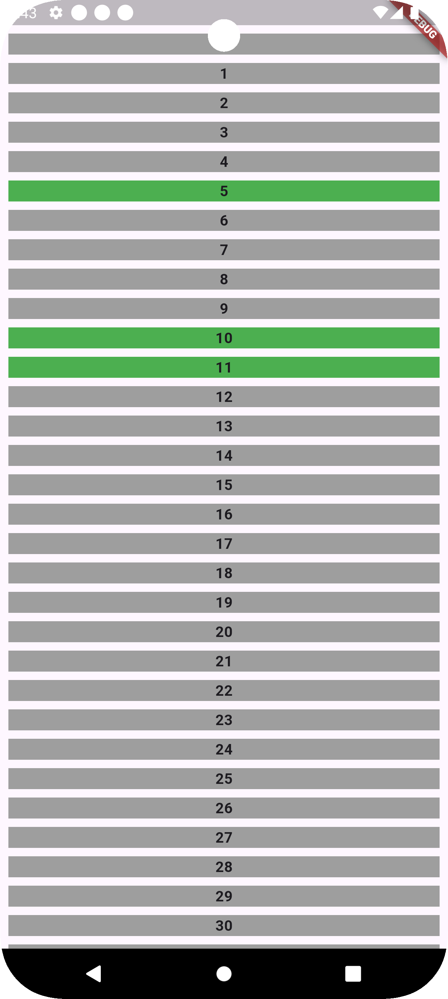
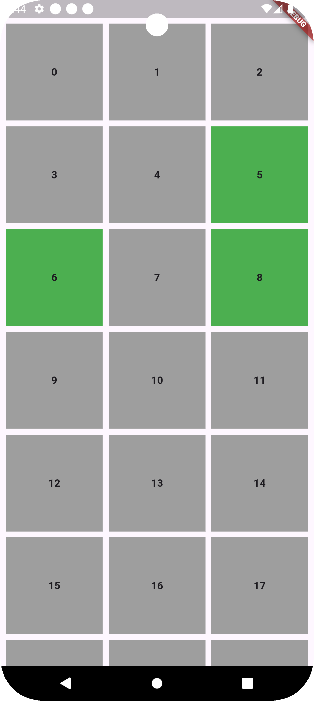
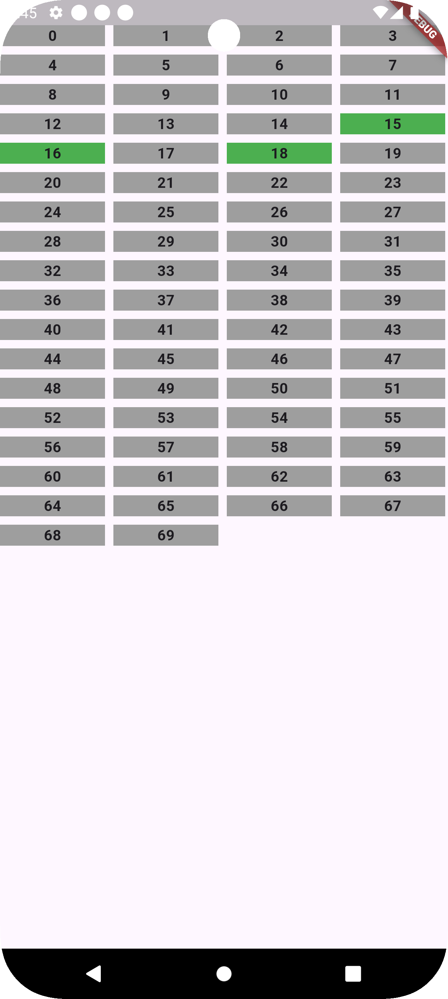

# selection_group

A fully customizable selection group.

## Installation

#### From pub.dev (Not yet available, use git based dependency management for now)

Add this to your `pubspec.yaml`

```yaml
dependencies:
  selection_group: ^0.0.1
```

#### Or, From Git repo (Internal members only)

```yaml
dependencies:
  selection_group:
    git:
      url: https://github.com/Ragibn5/dart-flutter-packages.git
      path: selection_group
      ref: main
```

## Get Started

Use the [`VivaSelectionGroup`](lib/src/selection_group.dart) to construct a selection group
widget.
It expects the following components:

- `uiModels`: List of ui models (Subtype of [
  `SelectionItemUiModel`](lib/src/models/selection_item_ui_model.dart)).
  If you want an item to be non-selectable, set `shouldBeSelected` = false.
- `layoutConfig`: A layout config (Subtype of [
  `SelectionGroupLayoutConfig`](lib/src/configs/selection_group_layout_config.dart)).
  Can be one of the following:
    - `ListSelectionGroupLayoutConfig`: For a `ListView` style selection group.
    - `GridSelectionGroupLayoutConfig`: For a `GridView` style selection group.
    - `WrapSelectionGroupLayoutConfig`: For a `Wrap` style selection group.
      See the constructor parameters of each config type to know all the customization you can make.
- `cellBuilder`: A callback to provide a scope where you can return the widget for the given index.
  Use the provided ui model and the selection status (named) to create the widget you want. Please
  note, you have to differentiate between selected and non-selected appearance with the widget you
  return to this callback. In fact, this package does not provide any default ui or styles at all,
  it shows what you provide.
- `onSelectionChanged`: A callback to notify the latest selected indices.
- `maxSelectionCount`: The maximum number of items that can be selected.
  By default it is null (which corresponds to unlimited selection count).
- `initialSelectionIndices`: The initial selection indices.
- `onSelectionOverflow`: Fired when tried to select more than `maxSelectionCount` items. No new
  items are selected.
- `leadingWidgets` & `trailingWidgets`: If you want to add specific widgets before and after the
  actual widgets (that are for selection).

<br>

For example, consider the following widget:

```dart
// The Ui Model
class TestItemUiModel extends SelectionItemUiModel {
  final int i;

  TestItemUiModel({super.shouldBeSelected = true, required this.i});
}

// Host Widget
class TestWidget extends StatelessWidget {
  final List<TestItemUiModel> uiModels;
  final SelectionGroupLayoutConfig layoutConfig;

  const TestWidget({
    super.key,
    required this.uiModels,
    required this.layoutConfig,
  });

  @override
  Widget build(BuildContext context) {
    return VivaSelectionGroup(
      uiModels: uiModels,
      layoutConfig: layoutConfig,
      cellBuilder: (model, {required selected}) =>
          _buildCell(model.i, selected),
      onSelectionChanged: (selectedModel) => debugPrint("$selectedModel"),
    );
  }

  // The cell builder method.
  // You should use a stateless widget instead, this is just for demonstration.
  Widget _buildCell(int i, bool selected) {
    return Container(
      color: selected ? Colors.green : Colors.grey,
      child: Center(
        child: Text(
          "$i",
          style: TextStyle(fontWeight: FontWeight.w700),
        ),
      ),
    );
  }
}
```

<br>

For `ListSelectionGroupLayoutConfig`:

```dart

final listLayoutConfig = ListSelectionGroupLayoutConfig.scrollable(
  spacing: 8,
  padding: EdgeInsets.all(8),
);
```

Preview:


<br>

For `GridSelectionGroupLayoutConfig`:

```dart

final gridLayoutConfig = GridSelectionGroupLayoutConfig.scrollable(
  horizontalSpacing: 8,
  verticalSpacing: 8,
  padding: EdgeInsets.all(8),
);
```

Preview:


<br>

For `WrapSelectionGroupLayoutConfig`:

```dart

final wrapLayoutConfig = WrapSelectionGroupLayoutConfig(
  spacing: 8,
  runSpacing: 8,
);
```

Preview:


## License

Click [here](../LICENSE) to see the license.